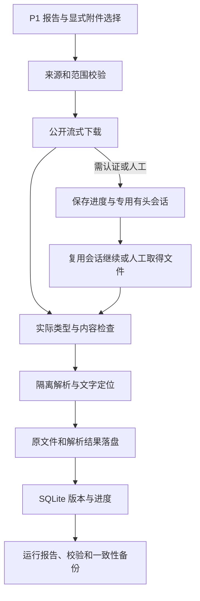

# P2：登录、附件与归档

后续修复（2026-09-24）：运行锁、人工来源复核状态、附件观察顺序与 DOCX 解析已修复，数据库当前为 schema 2。升级/回滚及合成验证见 [审查缺陷修复](D:/creator/coding_project/tender-assistant/docs/2026-09-24-审查缺陷修复.md)；下文保留 P2 当时的实测语境。

日期：2026-09-23，Asia/Shanghai。**P2 核心实现已完成，公开附件、解析、归档、重跑复用和备份恢复已实测通过；真实账号认证、跨日复用与 CA 尚未验证。** 用户已要求继续 P2，P1 未覆盖项仍保留，不视作已解决。

## 本轮范围与数据策略

从已保存的 P1 公告中显式选择附件，先验证公开下载，再根据实际认证要求使用专用有头会话或人工导入。首轮选择 DOC、XLSX、PDF、ZIP、DOCX 各一份真实附件；输入来自“软件”诊断公告，不算正式“网站开发”业务成果。

数据根目录沿用 `C:\Users\14629\AppData\Local\TenderAssistant`。保留原始公告、附件内容指纹、来源关系、版本、解析定位与失败状态，不自动删除；运行数据只在本机，不传给模型或外部服务。SQLite 及材料与源码分开，Windows 权限限制为当前用户和 SYSTEM。会话位于 `private/sessions/`，按来源和账号别名隔离。

备份在运行锁内生成一致的数据库副本，并复制公告、文件、解析结果和报告；带文件哈希清单。会话不进入备份。恢复只写全新目录，校验数据库、文件及解析结果，绝不覆盖已有归档。备份目前在同一磁盘，提供本地恢复核验，不宣称具备异地容灾能力。

本轮不办理投标报名、购买材料或签署，不启用通知、AI 或定时任务。登录是否必要、是否复用成功均按真实站点证据判断；保存配置目录本身不算真实认证验收通过。

## 真实样本与结果

2026-09-23 21:35:03—21:35:27，5 份文件全部公开下载成功，未登录。三份公告来自 P1 的“软件”诊断样本。每份文件都有来源公告、附件 URL、SHA-256、实际类型、下载状态、解析状态、文件路径和定位文本。

| 原公告 ID | 文件 | 实际格式 | 大小（字节） | 提取结果 |
|---|---|---|---:|---|
| 27391875 | 比价采购登记表 | DOC | 384,000 | 22 个文本段，352 字符 |
| 27391875 | 报价清单 | XLSX | 31,013 | 556 个单元格文本，9,351 字符 |
| 27390396 | 合同包 1 报价明细 | PDF | 665,557 | 10 页，8,074 字符 |
| 27390396 | 项目招标文件压缩包 | ZIP | 532,241 | 内含 PDF 和 DOCX，合计 1,757 个定位片段、133,095 字符 |
| 27390249 | 资格条件承诺函 | DOCX | 11,328 | 11 个文本段，298 字符 |

压缩包内 PDF 和 DOCX 是同一文件的不同格式，提取结果分别保留，不将其累计字符数视为独立条款数。XLSX 保留工作表 XML 与单元格位置、原始值/公式缓存，不执行公式或还原完整格式。PDF 文本顺序可能受表格和排版影响，解析成功不代表语义理解或投标准确性已验证。

证据入口：

- [脱敏验证摘要](D:/creator/coding_project/tender-assistant/docs/P2-verification.json)：文件名、来源域名、哈希、实际成绩和未覆盖项，可纳入 Git。
- [真实任务报告](C:/Users/14629/AppData/Local/TenderAssistant/runs/p2-73e744bf-0d47-4b5b-9336-e1644a201643/report.json)：完整来源、相对数据路径、状态与续跑结果；属于受限运行材料，不提交 Git。
- [备份清单](C:/Users/14629/AppData/Local/TenderAssistant/backups/2026-09-23T13-41-04-274Z-690248db/manifest.json)：16 个业务文件，含独立数据库副本，不含登录会话。
- 恢复演练目录：`C:\Users\14629\AppData\Local\TenderAssistant\restore-checks\check-1790170949223`，校验 5 个文件对象、3 个公告版本通过，未切换现用数据库。

已复跑同一个任务，5 份文件在哈希校验后复用，没有重复下载；最新解析实现还对保存的原文件进行了离线复验，5 份仍全部成功。数据库及文件一致性检查和新目录恢复通过。初次下载后的续跑状态会更新任务快照，后续事件追加保存到 `events.jsonl`。

## 技术组成与数据流



P2 以独立 CLI 运行，不修改 P1 的查询词或扩大全省站点。公开材料用流式 HTTP 下载；需要 Cookie 时从指定来源的专用会话中按 URL 获取，不写日志。仅依赖 Cookie 的请求不能代表兼容全部登录机制；JS、证书、交互下载等保留有头人工下载和文件导入通路。

PDF 使用 PDF.js，DOC 使用 word-extractor，DOCX/XLSX 使用受限 ZIP 和 XML 提取；ZIP 使用 yauzl 并校验 CRC。Node 24.13.0 内置 SQLite 已在本机运行，但该版本的模块仍属实验阶段，因此锁定运行版本并保留备份恢复验证。[Node.js 24.13.0 SQLite 文档](https://nodejs.org/download/release/v24.13.0/docs/api/sqlite.html)、[PDF.js](https://github.com/mozilla/pdf.js)、[yauzl](https://github.com/thejoshwolfe/yauzl)。

会话使用 `launchPersistentContext`，每个来源与账号别名独立目录、独占进程锁；不接管用户日常 Chrome/Edge。登录状态可保存不等于服务端会继续接受，认证结果必须结合实际受保护资源复核。[Playwright 认证文档](https://playwright.dev/docs/auth)。

实际运行目录：

```text
TenderAssistant/
├── archive.sqlite                 任务、公告版本、文件对象、来源关系
├── notices/<公告键>/<版本>.json   原公告及附件来源
├── objects/<哈希前缀>/<哈希>.<类型>
├── parsed/<文件哈希>-<解析哈希>.json
├── runs/<任务ID>/report.json      当前任务快照
├── runs/<任务ID>/events.jsonl     追加事件，不包含 URL 查询参数
├── private/sessions/<来源账号键>/ 专用会话，不提交、不备份
├── backups/<时间编号>/            数据库、业务文件、哈希清单
└── restore-checks/<演练编号>/     恢复演练副本，不自动切换
```

同一公告正文或附件清单变化形成新公告版本；仅签名参数改变不生成新版本。相同附件内容按 SHA-256 复用，但各公告、来源及下载版本关系保留。跨站项目/标包合并和有效公告关系判断仍属于后续业务处理，当前不以标题做合并。

## 运行、接管与恢复

所有命令均在 `D:\creator\coding_project\tender-assistant` 执行。新建任务示例与本轮选择一致：

```powershell
pnpm run archive:p2 --report output/playwright/2026-09-23T11-19-09-863Z-diagnostic/report.json --pick 27391875:0 --pick 27391875:3 --pick 27390396:0 --pick 27390396:1 --pick 27390249:1
```

`--pick` 为公告 ID 与从 0 开始的附件序号；必须来自报告，默认最多选 10 个。重复新建任务保留新的运行记录，但通过内容校验复用已有附件。程序输出任务 ID，应保存用于继续。

```powershell
pnpm run archive:p2 --resume p2-73e744bf-0d47-4b5b-9336-e1644a201643
pnpm run archive:p2 --verify
pnpm run archive:p2 --backup
pnpm run archive:p2 --restore-check C:/Users/14629/AppData/Local/TenderAssistant/backups/2026-09-23T13-41-04-274Z-690248db
```

`--resume` 默认跳过经过指纹核验的已取得内容，重试未完成项。要重新请求原链接检查内容变化，显式增加 `--refresh`；旧文件版本保留。任务中 Ctrl+C 或超过 15 分钟上限时保存状态，下一次使用同一任务 ID 继续。没有自动后台重试或定时任务。

遇到真实需要认证的附件时，再使用以下入口；目前这些来源的真实登录流程尚未验证：

```powershell
pnpm run archive:p2 --auth gdgpo --account default
pnpm run archive:p2 --resume <任务ID> --session gdgpo --account default
```

第一条只打开已登记来源主页，用户手动完成必要登录，在终端输入 `done` 保存；输入 `cancel` 或 Ctrl+C 取消。保存后的状态仍为“等待受保护资源验证”，不能仅因存在 Cookie 或返回主页就宣称登录成功。账号别名不使用真实密码，凭据在浏览器界面输入。

材料必须经浏览器交互取得时，可运行 `--resume <任务ID> --item <附件任务ID> --session gdgpo --manual-download`，由用户操作专用浏览器；程序只接收下载事件，不点击报名/付费按钮。此通路当前把来源一致性标为待复核，不将任意人工下载自动认定为目标文件。

文件已由人工取得时，使用 `--resume <任务ID> --item <附件任务ID> --import-file <本地文件>`；程序仍检查实际内容、大小、解析状态和指纹，保留人工导入来源。附件任务 ID 来自任务报告的 `items[].id`。

退出码：0 为当前操作完成；2 为部分完成/等待人工；130 为取消或运行时限；1 为配置、入口或未处理错误。返回 0 不代表真实认证、无头或所有格式已验收。

## 限制与失败处理

- 文件上限 50 MiB、请求超时 60 秒、解析超时 60 秒；解析放在可终止线程，JavaScript 堆上限 256 MiB。该限制不等同于整个进程总内存上限。
- ZIP 默认累计最多 200 个条目、100 MiB 解压数据、嵌套 2 层；拒绝路径穿越、链接、重复条目、异常膨胀和 CRC 错误，不向任意路径解压。
- 普通日志去掉 URL 查询参数，Cookie 不写日志；完整来源在受限清单中保存。重定向每跳检查已登记域名和路径；未知来源保留人工核验，不自动扩大范围。
- HTML 登录页不会保存为成功 PDF；加密、损坏、不支持格式、空文本/疑似扫描页和超时各自返回状态。P2 不执行 Office 宏/公式/程序，不做 OCR，不破解密码。
- 403/429 或待人工情况停止该来源后续下载，其余来源可以继续；单文件网络失败不推进该项成功状态。恢复按文件项继续，不从失败时刻推进整个 P1 查询窗口。
- 当前不会自动刷新过期签名链接；需要从原公告重新发现真实链接并登记。受控浏览器下载流程已测试，但政府站点真实账户权限、跨日会话、JS 令牌和 CA/UKey 尚未验证。

## 验证与交付

- `pnpm test`：**26 项通过**，包括原 P1 的 17 项和新增 P2 的 9 项。覆盖文件解析、损坏/加密/HTML、路径、限额、超时、版本、备份恢复、人工导入，以及本地受控会话关闭重开、失效恢复、下载取消、取消后不重复下载已完成文件。
- `pnpm run check`、`pnpm run build`（由测试执行）：通过。`pnpm install --frozen-lockfile --ignore-scripts`：通过。
- 收尾检查：58 个项目文件、8 份 JSON、26 个本地链接、25 个 Markdown 表格、UTF-8/空白、输出忽略规则及 `git diff --check` 均通过。无效 CLI 参数在运行前拒绝，未发现遗留 Playwright Chromium 进程或运行锁。
- 真实材料：5/5 下载解析成功，3 个公告版本；重复运行全部复用，离线复验通过；哈希和 SQLite 校验通过；16 文件一致性备份及新目录恢复通过。
- 首次 ZIP 加密合成测试因 fixture 缺少加密头长度而失败，修正合成结构后通过；未将该测试错误写成真实文件故障。依赖下载曾遇网络重试，最终安装成功，未放开安装脚本。
- 真实登录次数为 0；本地受控 Cookie 测试不能替代真实认证或跨日验证。未启用通知、模型调用、公司匹配或周期调度，未进入 P3。

新增 `config/p2.json`、`src/archive/`、`src/auth/`、`src/store/`、3 个测试/夹具文件、本文及 `P2-verification.json`；更新 package/锁文件、README、AGENTS、来源能力表、总体方案及模块/测试说明。任务类型为 P2 会话、附件解析、归档与恢复开发。

新增公共入口为 `archive:p2`；Node 要求从 >=20 提高为 >=24.13.0，原 P1 命令行为保持独立。代码回滚点为本次修改前的提交 `72d511f`，实际运行材料需独立保留，回滚源码不删除或覆盖数据库。未知数据库 schema 版本拒绝打开，不隐式降级。

剩余项：真实认证/跨日/CA、扫描件 OCR、更多站点与格式、过期链接重发现、异地备份，以及 P1 限流和正文模板缺口。它们均未冒充已完成。建议提交信息：`feat: 增加附件解析归档与会话恢复能力并验证 P2`；本轮未创建提交。
