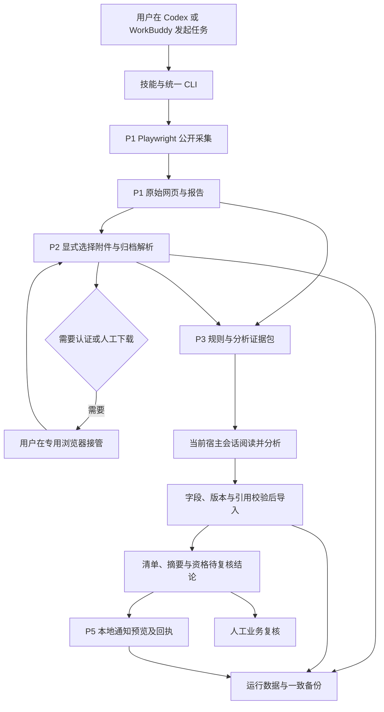

# 招投标助手最终技术方案

版本：P6 交接版；核验日期：2026-09-24；时区：Asia/Shanghai。本文描述当前代码与已取得证据，不将原计划中的目标视为已完成。业务基线见 [P0 记录](D:/creator/coding_project/tender-assistant/docs/P0-范围与环境确认.md)，具体操作见 [操作与维护手册](D:/creator/coding_project/tender-assistant/docs/操作与维护手册.md)，验收结论见 [P6 验收与交接](D:/creator/coding_project/tender-assistant/docs/P6-验收与交接.md)。

## 1. 交付定位

2026-09-24 后续代码审查已修复 6 项缺陷；以下架构描述同步到修复版，P6 历史业务数据与验收边界保持不变。数据升级、回滚和合成回归见 [修复记录](D:/creator/coding_project/tender-assistant/docs/2026-09-24-审查缺陷修复.md)。

当前可交付的是一个**本地运行、人工触发、人工复核、只生成通知预览的招投标助手原型**。它已连接公开网页采集、选定附件归档、规则清单、Codex / WorkBuddy 会话分析与通知预览；各步通过统一命令操作。当前尚未满足完整业务验收，不能作为无人值守的招标监测服务。

| 已确认事项 | 当前实现 |
|---|---|
| 业务与地区 | 正式关键词仅“网站开发”；广东采购地区；履约地不一致时复核 |
| 日期 | 包含当天的最近 7 个自然日；截止到每次采集开始，Asia/Shanghai |
| 门户 | 广东省公共资源交易平台、中国政府采购网；不等于覆盖全部地方交易系统 |
| 运行入口 | Codex / WorkBuddy 技能与本地 CLI；逐步手动调用 |
| 浏览器 | 项目内 Playwright Library，有头 Chromium；无头尚未独立验收 |
| 分析 | 规则先处理，当前 Codex 或 WorkBuddy 会话读证据并生成 JSON，再由代码校验导入 |
| 公司资质 | 具备逐项检查规范与合成材料验证；真实公司资料入口未启用 |
| 通知 | local-preview；无外部发送、无周期调度 |

没有启用“网站建设”等同义词扩展，也没有自行加预算或排除词限制。正式零结果与诊断查询分开记录。

## 2. 技术选择与职责

采用 **Node.js 24.13.0 + TypeScript ESM strict + pnpm 10.28.1 + Playwright 1.63.0 + Node 内置 SQLite + 本地文件**。依赖以 [package.json](D:/creator/coding_project/tender-assistant/package.json) 和锁文件为准；SQLite 在本机 Node 中仍显示实验性提示。

| 技术或组件 | 在本项目中的作用 | 选择的实际含义 |
|---|---|---|
| Playwright Library | 脚本控制搜索、翻页、详情和专用浏览器会话 | 脚本仍会操作真实网页；有头/无头只改变窗口是否显示，不会消除登录或验证码 |
| Codex / WorkBuddy Skill | 说明任务边界、读取证据、调用统一命令 | 共用技能源码，不单独实现采集，不保证所有候选自动处理完 |
| TypeScript 业务程序 | 时间窗口、采集状态、文件解析、版本、校验、去重、恢复 | 需要确定性和可重复验证的部分由程序负责 |
| 当前宿主会话 | 业务相关性、摘要、逐条资格解释 | 来源区分 codex-session / workbuddy-session；没有另启模型进程或 API 计费配置 |
| SQLite 与文件 | 附件索引、原始文件、任务和证据历史 | 无服务端部署，无向量库或消息队列 |

本项目采集不使用 agent-browser。2026-09-24 新增 WorkBuddy 本机技能安装，复用统一命令；本机版本、绑定路径和独立验证范围见 [WorkBuddy 适配记录](P4-WorkBuddy技能适配.md)。本机执行采集并不意味着宿主模型本地运行，真实公司材料仍需先明确服务与使用范围。P6 的历史验收结果保留其原日期和范围。

## 3. 当前执行流程

这些箭头代表数据关系，各阶段仍需显式调用，尚无自动全流程编排器。采集停止、材料缺失或分析未完成时，可以输出带限制的清单，但必须保留未完成状态。

### 3.1 公开采集与登录

- 全国站分别检索“广东不含深圳”和“深圳”，各有标题/全文查询。广东站使用站点分词，返回的“开发”相关内容不能直接算作网站开发商机。
- 每次固定查询窗口，记录已读页、终止原因和正文完整性。默认最多每查询 120 页、每站 20 份详情、每次 20 分钟，访问间隔至少 6 秒。详情是抽样，不是全量读取。
- HTTP 403/429、人工验证或页面异常有明确状态；限流后停止该站后续请求，不盲目重试。P1 没有断点续跑命令，重新执行是新一次采集。
- 广东已实现部分详情路由和限定公告区域内的封闭 Shadow DOM 正文读取。未知路由、正文不完整、附件链接未提取均仍是覆盖缺口。
- P2 以来源 origin 和账号别名隔离专用会话，保存于受限目录。`done` 仅确认人工已完成操作和会话已保存；还须用实际受保护附件验证权限。真实政府账号、跨日复用、CA/UKey 均未验收。

### 3.2 附件与存储

附件由用户或 Codex 从报告中显式选择，不自动下载全部候选。已登记全国站原生下载来源和广东政府采购文件来源；其他域名需依据真实公告确认。

支持 PDF、DOC、DOCX、XLSX、ZIP 的当前解析实现；扫描件需要 OCR 时明确报告，但未接入 OCR。加密、损坏及不支持格式不能作为正常已解析材料。程序不执行宏或附件中的程序。

默认单次最多 10 个附件，单文件 50 MiB；ZIP 最多 200 个条目、展开 100 MiB、嵌套 2 层。下载和解析超时各 60 秒，归档任务上限 15 分钟，实际配置见 [config/p2.json](D:/creator/coding_project/tender-assistant/config/p2.json)。

SQLite 保存 `jobs / notices / objects / links / items / archive_meta / observations`，当前数据库 schema 为 2；旧 schema 1 首次由新版打开时迁移。文件按 SHA-256 存储，观察按单调序号追加，保留 A→B→A 等刷新顺序及各次解析引用。来源待复核独立于解析成功；新 DOCX 解析按原 XML 顺序，版本为 `p2-v2`。P3/P5 的 JSON 记录仍位于 `runs/`，P5 payload 当前为 `p5-v2` 并兼容旧账本。

### 3.3 规则、提示词与 AI

| 位置 | 内容 |
|---|---|
| [prompts/relevance.md](D:/creator/coding_project/tender-assistant/prompts/relevance.md) | 网站开发相关性、排除原因与需复核项 |
| [prompts/summary.md](D:/creator/coding_project/tender-assistant/prompts/summary.md) | 区分事实、推断和缺失信息的摘要 |
| [prompts/qualification.md](D:/creator/coding_project/tender-assistant/prompts/qualification.md) | 资格条款逐项判断及采购/公司双方证据 |
| [src/analysis/](D:/creator/coding_project/tender-assistant/src/analysis/README.md) | 规则、字段、证据包、校验、持久化、清单与评估 |
| [schemas/analysis-result.schema.json](D:/creator/coding_project/tender-assistant/schemas/analysis-result.schema.json) | AI 输出字段规范；运行时校验器另校验证据与版本 |
| [skills/tender-assistant/SKILL.md](D:/creator/coding_project/tender-assistant/skills/tender-assistant/SKILL.md) | 宿主使用说明、调用顺序与边界 |

每个分析包嵌入当时的提示词、规则、公告和附件证据，记录 `inputHash / ruleVersion / promptVersion / companyVersion`。修改提示词需重新准备证据包，不能把旧结果直接套到新版本。事实引用必须是证据中的逐字片段；空白采购承诺模板不属于公司证明。

相关性为相关、不相关或待复核；任务是否分析、公告阶段、材料是否完整、资格结论分别记录。公司资料缺失时，资格为“资料不足”或“待复核”，不能写“符合”。当前公司输入仅允许明确合成数据，不得把真实材料改名 synthetic 绕过入口。

项目关联优先使用明确编号与采购人，保留不同公告、版本和标包；跨站模糊关联尚未完整验证。已跟踪更正不因关键词缺失直接丢弃，但程序尚未独立发现所有项目后续公告。输出校验通过只证明结构、版本与引文可核对，不等于语义判断已由业务人员验收。

### 3.4 通知、互斥和恢复

P5 从已有 P3 与原 P1 报告产生相关公告、项目更新、临期、运行故障和待复核提示。默认 72/24 小时临期窗口，仅采用精确到分钟且无冲突、无条件延期歧义的响应截止时间。合同、结果公告不能作为仍在招的项目提醒。

事件按用途、内容版本、渠道、接收对象去重。回执状态为 `pending → writing → previewed / failed / unknown`；未知结果先核对文件，失败需显式恢复，最多尝试 3 次。`previewed` 只表示本地文件生成；`local-user` 是本地标识，不是实际收件地址。P2 附件失败仍从 P2 报告查看，未全部自动纳入 P5 故障提示。

采集、归档、分析写入、通知和备份共用运行目录下 `archive.lock.sqlite` 的 SQLite 排他锁及 `archive.lock` PID 标记；专用浏览器另有同机制的会话锁。进程退出释放互斥，遗留标记在互斥内回收，不删除常驻互斥数据库。取消清理本次创建的资源，不结束用户其他浏览器。P1 没有增量检查点，P5 的正文/附件版本观察也不代表成功采集或已外部送达。

## 4. 实际目录与数据边界

| 绝对位置 | 保存内容 | Git / 备份 |
|---|---|---|
| `D:\creator\coding_project\tender-assistant\` | `src/`、`config/`、`prompts/`、`schemas/`、`skills/`、`integrations/`、`docs/`、测试与锁文件 | 源码纳入 Git；依赖和 dist 不提交 |
| `D:\creator\coding_project\tender-assistant\output\playwright\` | P1 网页、详情、截图及各阶段本地验证证据 | Git 忽略；**不在归档备份内，必须另保留** |
| `C:\Users\14629\AppData\Local\TenderAssistant\archive.sqlite` | 附件索引、任务、公告与对象关系 | 不提交 Git；一致备份包含 |
| 同一数据根的 `objects/`、`parsed/`、`notices/` | 原附件、解析结果、已归档公告版本 | 一致备份包含 |
| 同一数据根的 `runs/p2-*/`、`runs/p3-*/` | 任务记录、分析包、原始模型结果、清单与版本历史 | 一致备份包含 |
| 同一数据根的 `runs/p5-*/`、`runs/p5-notifications/` | 预览、回执、通知账本与状态历史 | 一致备份包含 |
| 同一数据根的 `private/sessions/` | 浏览器登录会话，按来源和账号隔离 | 不提交 Git；不备份 |
| 同一数据根的 `backups/`、`restore-checks/` | 备份与恢复演练副本 | 同盘本地副本，不代表异地容灾 |
| `C:\Users\14629\.codex\skills\tender-assistant\` | 本机技能安装副本、项目绑定及安装清单 | 由项目安装器管理；不存业务逻辑副本或运行资料 |

运行数据目录采用当前 Windows 用户与 SYSTEM 的访问权限。P1 证据在项目内，不自动继承该数据根的受限权限，分享或迁移前需检查实际 ACL 和材料内容。Cookie、密钥和公司原始材料不得进入 Git、普通日志或提示词。正文与附件始终作为待分析数据，不提供执行指令的权限。

备份通过 SQLite `VACUUM INTO` 加文件哈希清单生成，恢复到新目录核验，不覆盖当前数据。P3/P5 仍引用原 P1 报告绝对路径，搬家后不能仅复制数据库；异机重绑定与完整迁移还未验证。

## 5. 已取得的效果与限制

以下网站数据采于 **2026-09-23**；2026-09-24 P6 仅重新核验本地文件，没有重新访问政府网站。

| 项目 | 可复核结果 | 不能据此声称 |
|---|---|---|
| 正式采集 | 全国站 4 个查询零结果；广东 49 页、488 个唯一候选，第 50 页 429；20 份详情中 14 完整、2 部分、4 失败 | 最近 7 天全量覆盖，或 488 个有效商机 |
| 附件 | 诊断用途 5 个真实文件、3 份公告，归档和解析校验通过 | 正式网站开发项目附件完整，或真实认证已通过 |
| 分析 | 正式 4/488、诊断 3/40 已导入；正式 484、诊断 37 尚待分析；当前初判相关均为 0 | 没有市场机会、全量分析完毕、准确率达标 |
| 预览 | 正式 2 条、诊断 3 条；3 次运行共 5 条预览，重复正式运行新增 0 | 对外送达，或产生了 5 个相关项目 |
| 恢复 | 当前归档与回执核验通过；P5 备份 3,299 文件哈希一致，原恢复演练目录仍可通过校验 | P1 证据已备份、跨机器恢复或长期稳定运行 |
| 回归 | 本轮 56 项测试通过，类型检查通过 | 真实站点当前仍可访问、登录成功或业务质量通过 |

正式预览主要提示历史限流及分析覆盖缺口，没有编造相关项目。完整统计、命令、指纹和验收矩阵见 [P6 记录](D:/creator/coding_project/tender-assistant/docs/P6-验收与交接.md)。

## 6. 后续实施顺序

1. **先补采集可靠性**：在约定范围内低频复核广东分页、总数变化和未知详情路由，补齐正式正文与附件；决定全量详情、分批采集及断点续跑策略。
2. **再做业务质量验收**：业务人员标注代表性样本，明确待复核率与精确率/保留召回率目标；完成足量正式分析。零相关预测时精确率无分母，不写 100%。
3. **按实际来源验证登录**：人工首次登录、受保护资源、关闭重开、跨日失效与恢复逐来源登记；再单独比较无头模式。
4. **接入真实公司资料**：明确证据负责人、有效期及模型使用范围，开发真实资料入口并做双方证据验收。
5. **最后接入持续运行**：选择具体通知渠道、接收对象、触发时间及主机，完成外部回执适配、重复/未知结果处理和不少于 3 个实际运行日的试运行。人工登录依赖未消除前仍需有人接管。

上述是待开展工作，不属于 P6 已自动实施或默认启用的范围。用户已于 2026-09-24 确认接收本地手动、人工复核、仅通知预览的阶段性交付，并保留现有待完成项；完整业务验收仍未通过，详见 P6 交接确认栏。
